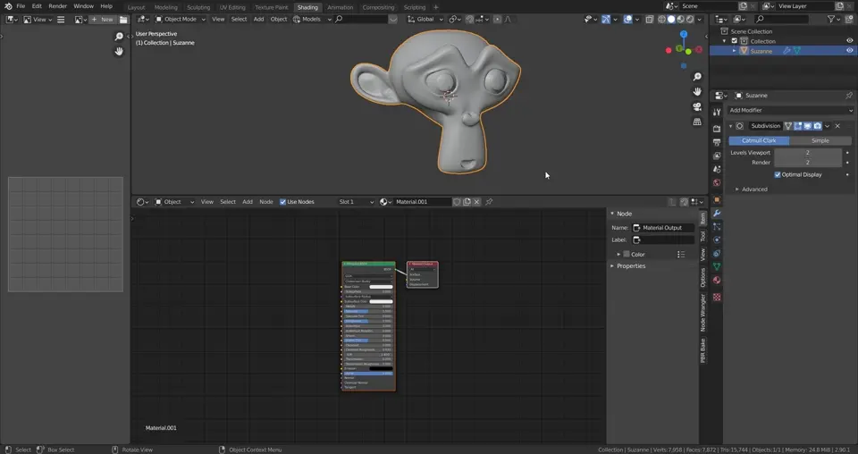
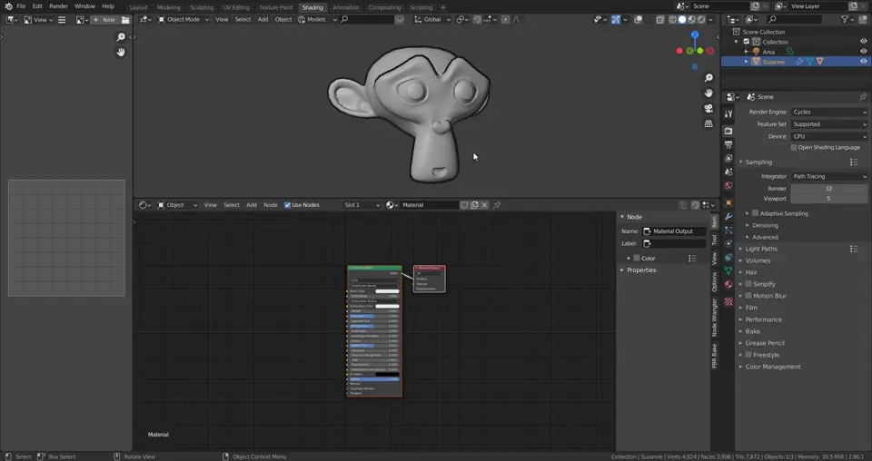

# Create Outline Objects In Blender With Ease

 **This blender addon creates an outline object for your objects with materials**

# What it do?

What this does is creates an outline object for your objects in blender. The process of doing this manually can be rather tedious so this addon speeds that up

This includes:

* Duplicates the object, flips the normals, adds a displacement modifier with small size increase, adds a .outline to the name and reparents to the original object
* Creates a new material tailored for outlines 
* Custom node for cycles outline materials that is shadeless and backface culling
* Turns off all the cycles ray visibility modes except for camera so that the outline object doesn't effect the shading of the orignal object in cycles

## Works in both EEVEE and Cycles

# Installation

1. Download add-on (zipped) from this link.
2. In blender, go to : Edit -> Preferences -> Add-ons -> Install -> Navigate to the folder where you downloaded the zip file.

## [Now that it's installed the Full Tutorial can be found here](https://github.com/TehMerow/blender_create_outline_mesh/wiki/Tutorial)
